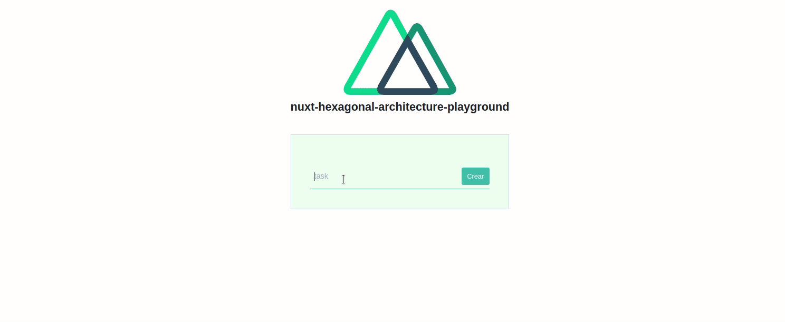

<h1 align="center">
  🐘🎯 Arquitectura Hexagonal, DDD & CQRS en nuxt
</h1>

<p align="center">
  Ejemplo de una <strong>aplicación front-end con nuxt usando los principios de DDD y CQRS</strong>
</p>

## 🛫 Requerimientos
* [Node v10.13](https://nodejs.org/en/): recomendamos usar la LTS.
* Un editor de texto, recomendamos [VSCode](https://code.visualstudio.com/) con la extensión [Vetur](https://marketplace.visualstudio.com/items?itemName=octref.vetur) o [WebStrom](https://www.jetbrains.com/webstorm/).
* Una terminal de comandos, recomendamos [la terminal integrada de VSCode](https://code.visualstudio.com/docs/editor/integrated-terminal) o [la terminal del Webstorm](https://www.jetbrains.com/help/webstorm/terminal-emulator.html).
* Un gestor de paquetes como [Yarn](https://yarnpkg.com/) o [npm](https://www.npmjs.com/). Recomendamos usar **yarn**.

## 🚀 Instalación

```bash
# Instalamos las dependencias
$ yarn install

# Arracna el servidor de desarrollo en modo "hot reload" en http://localhost:3000
$ yarn dev
```

Ahora puedes verificar que todo funciona accediendo a [http://localhost:3000](http://localhost:3000)

## 💪 Motivación 

TODO

## 👩‍💻 Explicación del proyecto

### Idea del proyecto

Es un Todo App para la gestión de tareas.

<p align="center">
  
</p>

### Estructura de carpetas

```
src
├── shared // shared kernel: infraestructura y dominio común al resto de modulos de la aplación
│ ├── domain
│ └── infrastructure
└── todo // Modulo de aplicación
    ├── application // Dentro de esta carpeta residiran los casos de uso
    │ ├── create
    │ └── list
    ├── domain // Dentro de esta carpeta residiran todo nuestro dominio: Agregados, entidades, objetos de valor, eventos, errores
    │ ├── TodoBody.ts
    │ ├── TodoCreatedAt.ts
    │ ├── TodoId.ts
    │ ├── TodoRepository.ts 
    │ └── Todo.ts // El agregado del modulo
    └── infrastructure // Detrno de esta carpeta residiran la infraestructura de nuestro modulo
        └── InMemoryTodoRepository.ts
```

## ✅ Tareas para el futuro

* [ ] Añadir tests unitarios, de integración y e2e.
* [ ] Añadir casos de uso más complejos para poder exponer de mejor forma el aporte de esta arquitectura.
* [ ] Añadir wiki explicando como pasar de un proyecto legacy a hexagonal, argumentando cada paso con sus pros y contras.

## 🧑‍🤝‍🧑 Contribuir

TODO
